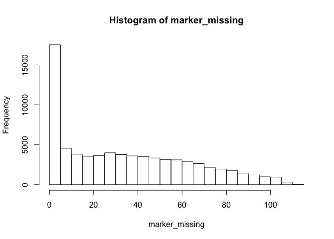
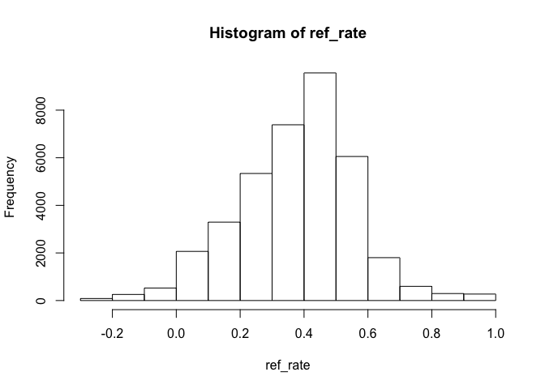

This scripts takes the FreeBayes output (minimally process with vcftools), does some preliminary filtering and shapes the file for LepMap. The example data used here is from a lettuce *(Lactuca sativa)* RIL population

## 1.1 Raw FreeBayes output -> preliminary filtering
### Define population and parents

```r
P1 = "Lolla_Rosa"
P2 = "Red_Tide"
pop = "RTxLR"
```

### Start from Freebayes output

```r
#install.packages("data.table")
library(data.table)

pos = fread("/Users/rongkui/Desktop/Lab/Admin/RTxLR_filtered.vcf.012.pos",sep = "\t")
head(pos)
```

```
##                V1     V2
## 1: NW_019672047.1 470524
## 2: NW_019672047.1 470537
## 3: NW_019672047.1 637777
## 4: NW_019672051.1  56198
## 5: NW_019672052.1  20125
## 6: NW_019672052.1  29241
```

```r
length(unique(pos$V1))
```

```
## [1] 2445
```

```r
pos$V2 = as.character(pos$V2)
pos1 = paste(pos$V1, pos$V2, sep =".")
head(pos1)
```

```
## [1] "NW_019672047.1.470524" "NW_019672047.1.470537" "NW_019672047.1.637777"
## [4] "NW_019672051.1.56198"  "NW_019672052.1.20125"  "NW_019672052.1.29241"
```

```r
pos.fin = cbind(pos1, pos$V1)
head(pos.fin)
```

```
##      pos1                                    
## [1,] "NW_019672047.1.470524" "NW_019672047.1"
## [2,] "NW_019672047.1.470537" "NW_019672047.1"
## [3,] "NW_019672047.1.637777" "NW_019672047.1"
## [4,] "NW_019672051.1.56198"  "NW_019672051.1"
## [5,] "NW_019672052.1.20125"  "NW_019672052.1"
## [6,] "NW_019672052.1.29241"  "NW_019672052.1"
```

```r
indiv = read.table("/Users/rongkui/Desktop/Lab/Admin/RTxLR_filtered.vcf.012.indv", header = FALSE, stringsAsFactors = FALSE)
indiv = t(indiv)
geno = fread("/Users/rongkui/Desktop/Lab/Admin/RTxLR_filtered.vcf.012",sep = "\t")
geno = t(geno[,-1])
geno[1:10,1:10]
```

```
##     [,1] [,2] [,3] [,4] [,5] [,6] [,7] [,8] [,9] [,10]
## V2     2    2   -1    2   -1    2    2    2   -1     2
## V3     2    2   -1    2   -1    2    2    2   -1     2
## V4    -1    2    2    2    2    2    2    2    2     2
## V5     0    0    0    0    0   -1   -1    0   -1    -1
## V6     1    1    0    2    2    0   -1    1   -1    -1
## V7     0    0    0    0    0    0    0    0    0     0
## V8     2    0    0    2    1   -1    1    1    0     0
## V9     0    0    0    0    0    0    0    0    0     0
## V10    2    2    2    2   -1   -1   -1    2    2    -1
## V11   -1   -1   -1   -1    2    0    2   -1    2    -1
```

```r
nrow(pos.fin) == nrow(geno)
```

```
## [1] TRUE
```

```r
geno2 = cbind(pos.fin, geno)
geno2 = as.data.frame(geno2)
names(geno2)[-c(1,2)] = indiv
geno2[1:10,1:10]
```

```
##                       pos1             V2 100 101 102 103 104 105 106 107
## V2   NW_019672047.1.470524 NW_019672047.1   2   2  -1   2  -1   2   2   2
## V3   NW_019672047.1.470537 NW_019672047.1   2   2  -1   2  -1   2   2   2
## V4   NW_019672047.1.637777 NW_019672047.1  -1   2   2   2   2   2   2   2
## V5    NW_019672051.1.56198 NW_019672051.1   0   0   0   0   0  -1  -1   0
## V6    NW_019672052.1.20125 NW_019672052.1   1   1   0   2   2   0  -1   1
## V7    NW_019672052.1.29241 NW_019672052.1   0   0   0   0   0   0   0   0
## V8   NW_019672052.1.483522 NW_019672052.1   2   0   0   2   1  -1   1   1
## V9  NW_019672052.1.1037897 NW_019672052.1   0   0   0   0   0   0   0   0
## V10 NW_019672052.1.1090647 NW_019672052.1   2   2   2   2  -1  -1  -1   2
## V11 NW_019672052.1.1132626 NW_019672052.1  -1  -1  -1  -1   2   0   2  -1
```

```r
#write.table(geno2, "/Users/rongkui/Desktop/Lab/Aim1_Photoperiod/ArmxPI.v8.freebayes_Jun2020.vcf", row.names = TRUE, col.names = TRUE, quote = FALSE)
```

### Check marker count

```r
dim(geno2) #73921   114
```

```
## [1] 73921   114
```

### check missingness

```r
marker_missing = (geno == '-1')
marker_missing = rowSums(marker_missing)
hist(marker_missing)
```

<!-- -->

### filtering markers for missing < 50% individuals

```r
marker_missing = marker_missing/ncol(geno)
geno_missing_filtered = geno2[marker_missing < 0.5,]
geno2 = geno_missing_filtered
```

### filtering for markers that segregate

```r
geno2 = geno_missing_filtered
geno_seg = (geno2[,which(colnames(geno2) == P1)] != geno2[,which(colnames(geno2) == P2)])
sum(geno_seg) #37533
```

```
## [1] 37533
```

```r
geno2 = geno2[geno_seg,]
```

### filtering for segregation distortion

```r
geno3 = geno2
for (i in 3:ncol(geno3)) {
  geno3[,i] = as.numeric(as.character(geno3[,i]))
}
ref = rowSums(geno3[,-c(1,2)])
ref_rate = ref/(2*(ncol(geno3)-2))
hist(ref_rate)
```

<!-- -->

The numbers are biased towards 0 because of missing data. 


```r
geno3 = geno3[ref_rate > 0.2 & ref_rate < 0.7,]
dim(geno3) #30144   114
```

```
## [1] 30144   114
```

### Filter out markers with heterozygous or missing calls for the parents

```r
het_parent = (geno2[,which(colnames(geno2) == P1)] == 1 | geno2[,which(colnames(geno2) == P1)] == 1)
sum(het_parent) #960
```

```
## [1] 960
```

```r
geno3 = geno3[het_parent == FALSE,]
dim(geno3) #36573   114
```

```
## [1] 36573   114
```


## 1.2 Save to LepMap3 format

```r
names = names(geno3)[-1]
names[1] = "SNP"
names[names != 'SNP' & names != P1 & names != P2 & names != ""] = paste('RIL', names[names != 'SNP' & names != P1 & names != P2 & names != ""], sep = "")
tkept = geno3[,-2]
for (j in 1:ncol(tkept)) {
  tkept[,j] = as.character(tkept[,j])
}
tkept = rbind(names,tkept)
unique(tkept[,3])
```

```
## [1] "RIL101" "2"      "1"      "0"      "-1"     NA
```

```r
tkept[tkept == "0"] = "AA"
tkept[tkept == "1"] = "AB"
tkept[tkept == "2"] = "BB"
tkept[tkept == "-1"] = "NoCall"
tkept[1:10,1:10]
```

```
##                       pos1    100    101    102    103    104    105    106
## 1                      SNP RIL100 RIL101 RIL102 RIL103 RIL104 RIL105 RIL106
## V2   NW_019672047.1.470524     BB     BB NoCall     BB NoCall     BB     BB
## V3   NW_019672047.1.470537     BB     BB NoCall     BB NoCall     BB     BB
## V6    NW_019672052.1.20125     AB     AB     AA     BB     BB     AA NoCall
## V8   NW_019672052.1.483522     BB     AA     AA     BB     AB NoCall     AB
## V14 NW_019672052.1.1490782     AB     AB     AA     BB     AB     AA     AB
## V24 NW_019672052.1.2587971     AB NoCall NoCall     AB     AB     AA     AB
## V27 NW_019672052.1.2590860     AB     AB     AA     BB     AB     AA     AB
## V28 NW_019672052.1.2590972     AB     AB     AA     AB     AA     AB     AA
## V29 NW_019672052.1.2590983     AB     AB     AB     AB     AA     BB     AA
##        107    108
## 1   RIL107 RIL108
## V2      BB NoCall
## V3      BB NoCall
## V6      AB NoCall
## V8      AB     AA
## V14     AA     AA
## V24     BB     AB
## V27     AB     AA
## V28     AB     AA
## V29     AB     AA
```

```r
#tkept = as.data.fram(tkept)
```

#### Add dummy F1 individuals

```r
F1_1 = c('F1_1', rep("AB", (nrow(tkept)-1)))
F1_2 = c('F1_2', rep("AB", (nrow(tkept)-1)))
tkept = cbind(tkept, F1_1)
tkept = cbind(tkept, F1_2)
tkept[1:10, 1:10]
```

```
##                       pos1    100    101    102    103    104    105    106
## 1                      SNP RIL100 RIL101 RIL102 RIL103 RIL104 RIL105 RIL106
## V2   NW_019672047.1.470524     BB     BB NoCall     BB NoCall     BB     BB
## V3   NW_019672047.1.470537     BB     BB NoCall     BB NoCall     BB     BB
## V6    NW_019672052.1.20125     AB     AB     AA     BB     BB     AA NoCall
## V8   NW_019672052.1.483522     BB     AA     AA     BB     AB NoCall     AB
## V14 NW_019672052.1.1490782     AB     AB     AA     BB     AB     AA     AB
## V24 NW_019672052.1.2587971     AB NoCall NoCall     AB     AB     AA     AB
## V27 NW_019672052.1.2590860     AB     AB     AA     BB     AB     AA     AB
## V28 NW_019672052.1.2590972     AB     AB     AA     AB     AA     AB     AA
## V29 NW_019672052.1.2590983     AB     AB     AB     AB     AA     BB     AA
##        107    108
## 1   RIL107 RIL108
## V2      BB NoCall
## V3      BB NoCall
## V6      AB NoCall
## V8      AB     AA
## V14     AA     AA
## V24     BB     AB
## V27     AB     AA
## V28     AB     AA
## V29     AB     AA
```

```r
tkept[1:10, (ncol(tkept)-9):ncol(tkept)]
```

```
##        95    96    97    98     99    9 Lolla_Rosa Red_Tide F1_1 F1_2
## 1   RIL95 RIL96 RIL97 RIL98  RIL99 RIL9 Lolla_Rosa Red_Tide F1_1 F1_2
## V2     BB    BB    BB    BB NoCall   BB     NoCall       BB   AB   AB
## V3     BB    BB    BB    BB NoCall   BB     NoCall       BB   AB   AB
## V6     AA    AA    AB    AB     AB   AA         AA       BB   AB   AB
## V8     AB    AA    AB    AB     AB   AB         AA       BB   AB   AB
## V14    AB    AB    AB    AB     AB   AB         AA       BB   AB   AB
## V24    BB    AB    AA    BB     AB   AB         AA       AB   AB   AB
## V27    AB    AB    AB    AB     AB   BB         AA       BB   AB   AB
## V28    AB    AB    AA    AA     AB   AA         AB       AA   AB   AB
## V29    AB    AB    AA    AA     AB   AA         AB       AA   AB   AB
```

```r
write.table(tkept, file = "/Users/rongkui/Desktop/Lab/Admin/RTxLR_LepMap_genotypes_all.txt", sep = "\t", quote = FALSE, col.names = FALSE, row.names = FALSE)
```

### Pedigree file for LepMap3

```r
indiv = tkept[1,-1]
row1 = c("CHR","POS",rep(pop, (ncol(tkept)-1) ))
row2 = c("CHR","POS", tkept[1,-1])
vec = rep("F1_1",(ncol(tkept)-1) )
vec[indiv == P1 | indiv == P2] = '0'
vec[indiv == 'F1_1' | indiv == "F1_2"] = P1
row3 = c("CHR","POS", vec)
vec = rep("F1_2",(ncol(tkept)-1) )
vec[indiv == P1 | indiv == P2] = '0'
vec[indiv == 'F1_1' | indiv == "F1_2"] = P2
row4 = c("CHR","POS", vec)
vec = rep(0,(ncol(tkept)-1) )
vec[indiv == P1 | indiv == "F1_1"] = '1'
vec[indiv == P2 | indiv == "F1_2"] = '2'
row5 = c("CHR","POS", vec)
row6 = c("CHR","POS", rep(0,(ncol(tkept)-1)))
pedigree = rbind(row1, row2, row3, row4, row5, row6)
pedigree[2, c((ncol(pedigree)-1), ncol(pedigree))] = c('F1_1', 'F1_2')
write.table(pedigree, file = "/Users/rongkui/Desktop/Lab/Admin/RTxLR_pedigree.txt", sep = "\t", quote = FALSE, row.names = FALSE, col.names = FALSE)
```

